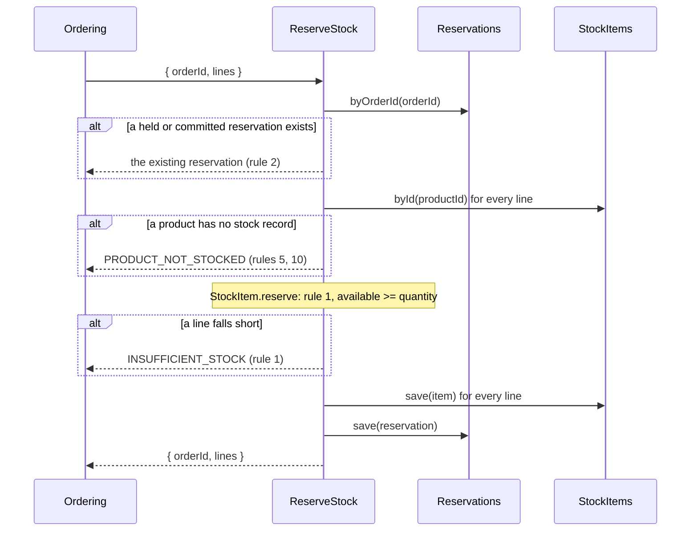
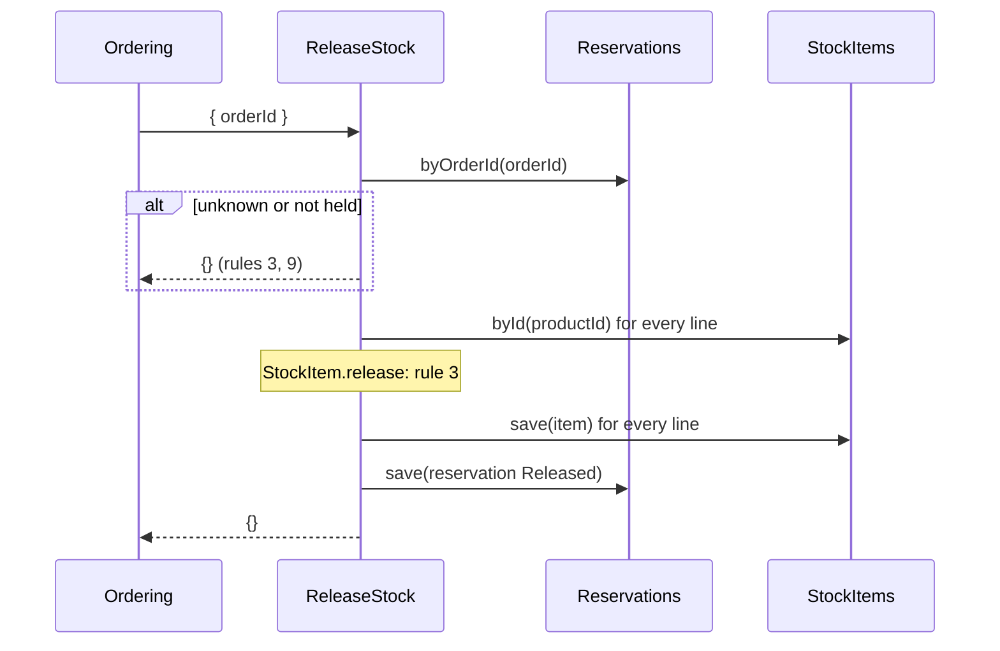
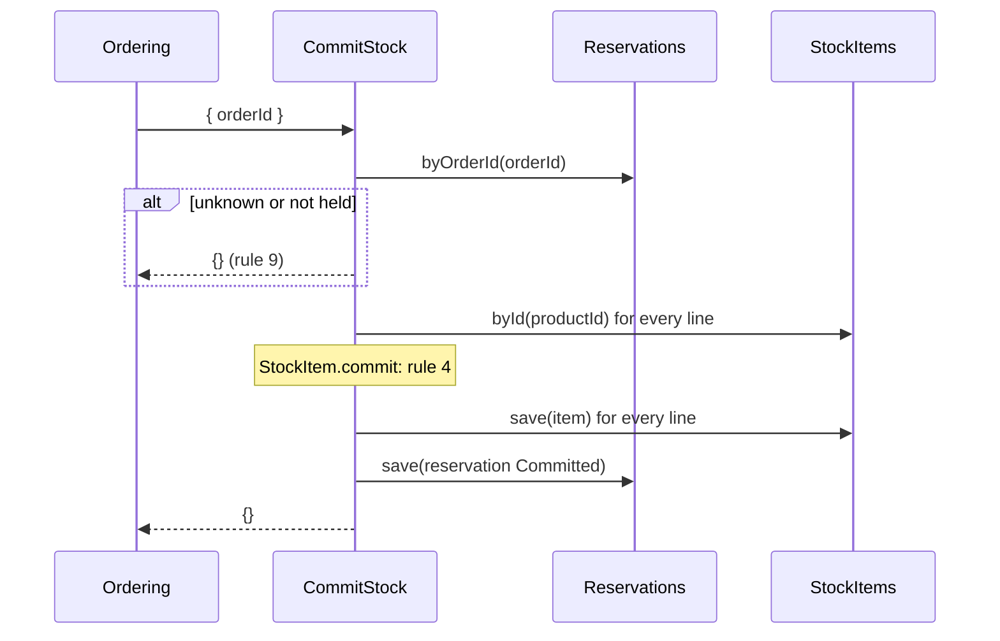
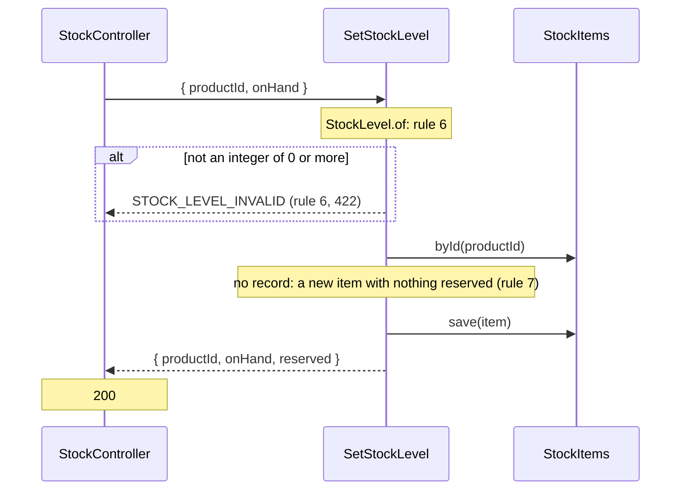
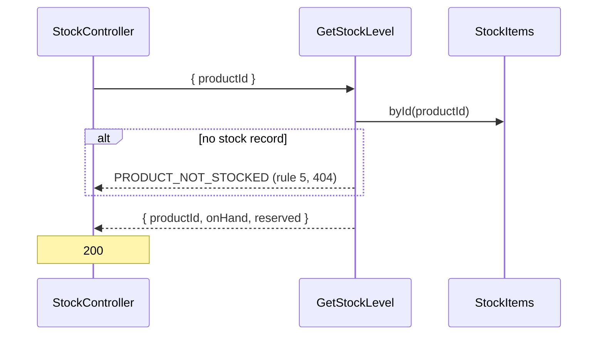

# Inventory — flows

Sequence diagrams for [inventory](domain-model.md). Rule numbers refer to its Business rules. One Mermaid `sequenceDiagram` per use case whose request crosses more than one component: controller, use case, driven ports, and whatever happens after the response.

## ReserveStock

Called by ordering through the barrel; no route.

## ReleaseStock

## CommitStock

## SetStockLevel

## GetStockLevel

