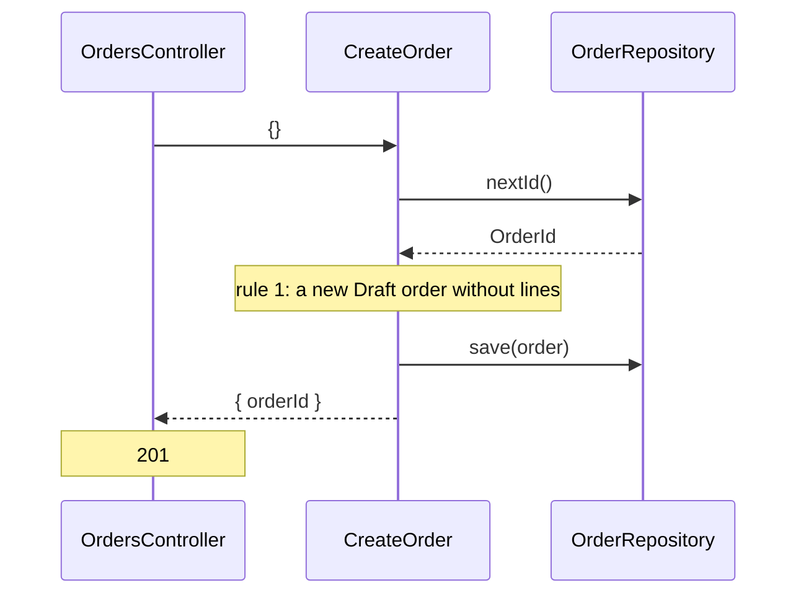
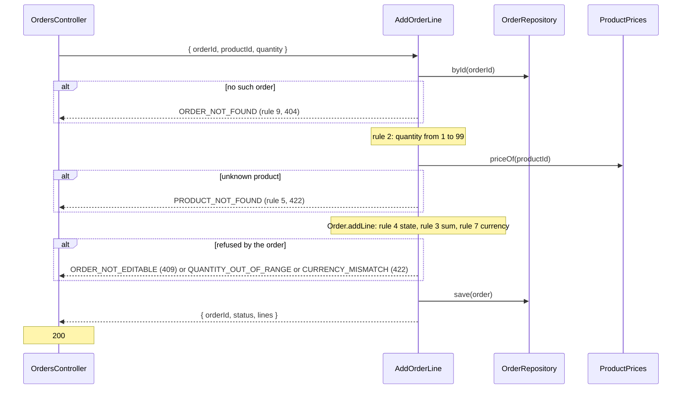
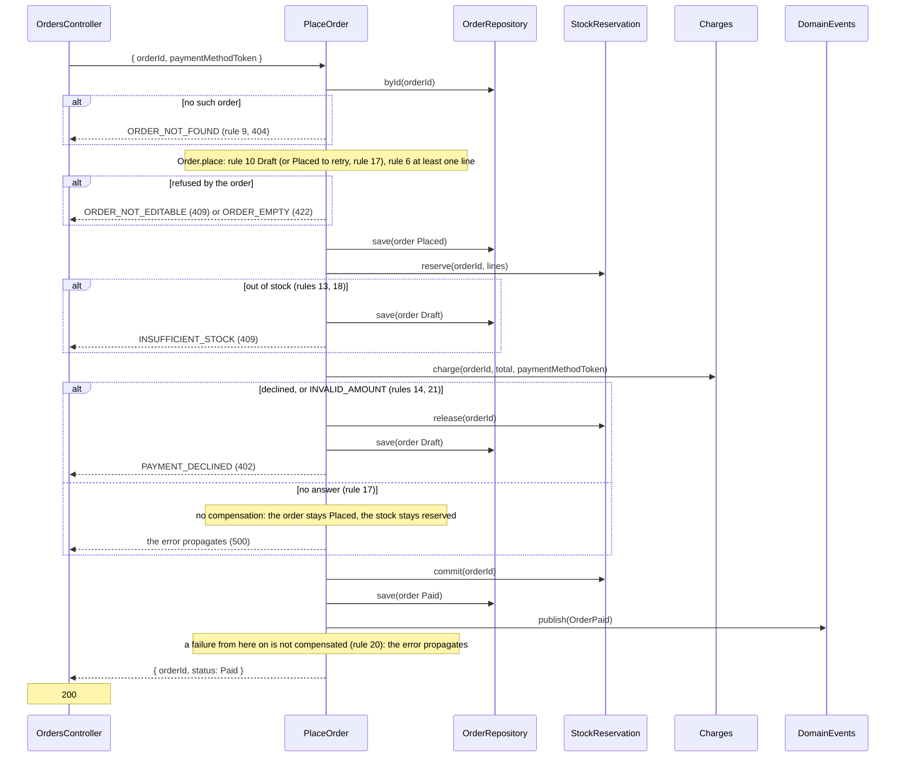
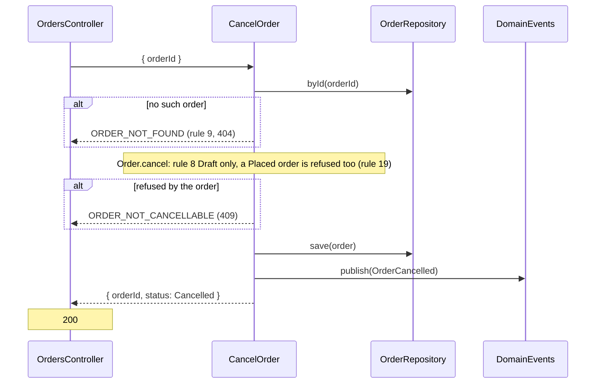
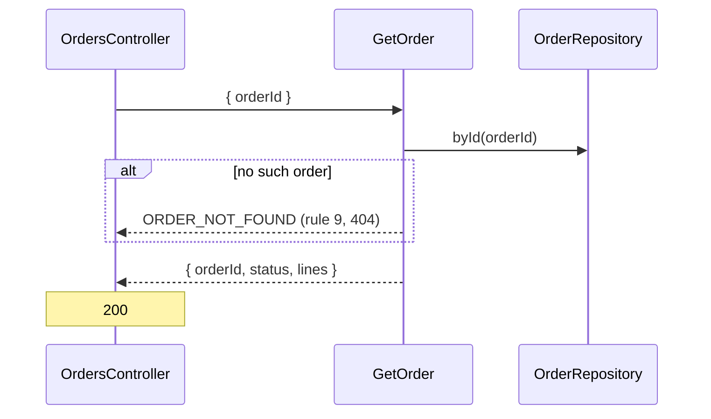

# Ordering — flows

Sequence diagrams for [ordering](domain-model.md). Rule numbers refer to its Business rules. One Mermaid `sequenceDiagram` per use case whose request crosses more than one component: controller, use case, driven ports, and whatever happens after the response.

## CreateOrder

## AddOrderLine

## PlaceOrder

The process manager of rules 12 to 18. `Charges` and `StockReservation` are the ports to payments and inventory.

## CancelOrder

## GetOrder

