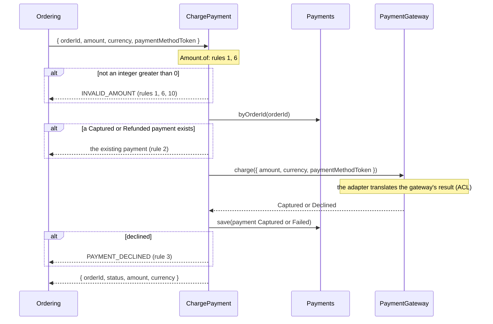
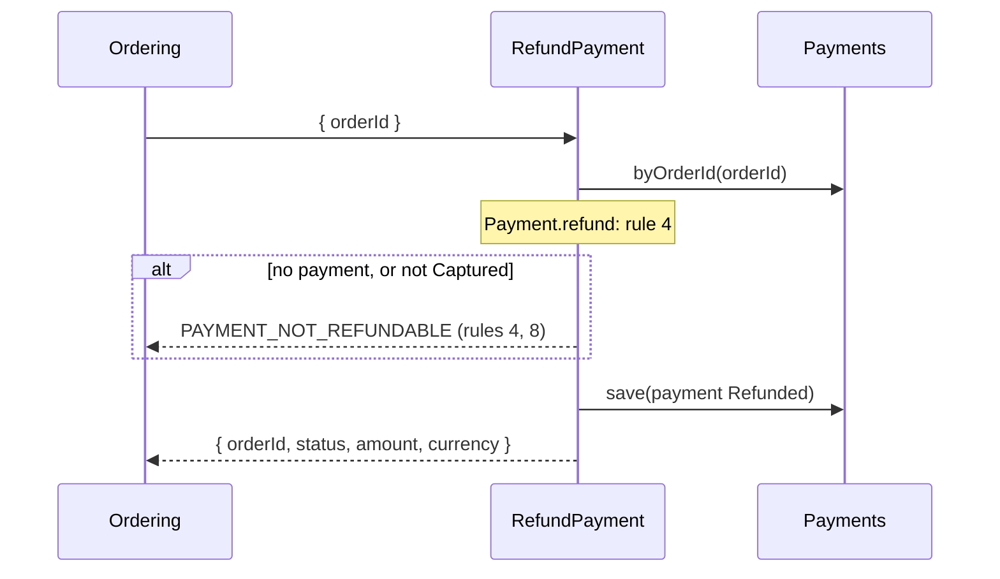

# Payments — flows

Sequence diagrams for [payments](domain-model.md). Rule numbers refer to its Business rules. One Mermaid `sequenceDiagram` per use case whose request crosses more than one component: controller, use case, driven ports, and whatever happens after the response.

## ChargePayment

Called by ordering through the barrel; no route.

## RefundPayment

